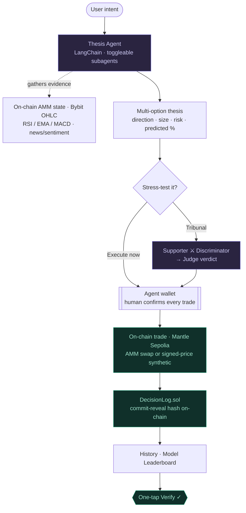
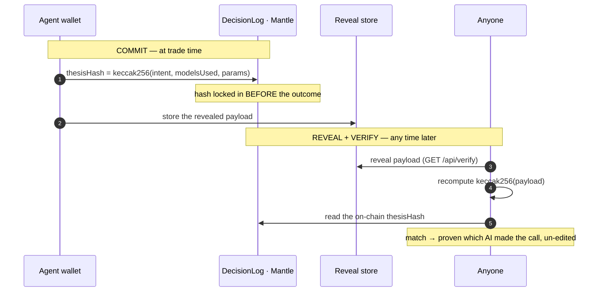

<div align="center"> 
 
# 🜂 Autonoe

### Verifiable AI trading on Mantle — cross-examined decisions, executed on-chain, provable forever.

*You don't trust the strategy. You trust the verified record.*


</div>

---

Most "AI trading bots" are black boxes: you're told a model is profitable, but you can't verify **which** model made **which** call, or whether the record was edited after the fact. Autonoe fixes that.

An AI agent researches the market and produces a **multi-option trading thesis**. A three-agent **tribunal** (Supporter ⚔ Discriminator → Judge) cross-examines it. An **embedded agent wallet** executes the chosen option as a **real on-chain trade on Mantle**. And every decision is **committed on-chain with a commit-reveal hash** — so anyone can later prove which AI produced a winning call, locked in *before* the outcome was known, with the strategy itself kept private until you choose to reveal it.

> Built for the Mantle **"The Turing Test"** Hackathon 2026 · *AI Trading & Strategy · Agentic Wallets & Economy · Best UI/UX*

---

## ✨ Why Autonoe is different

| | |
|---|---|
| 🧑‍⚖️ **Cross-examined, not one-shot** | Every thesis can be sent to a tribunal where a **Discriminator** is *required* to argue the bear case before a **Judge** rules. Decisions survive an adversary, not just a hot take. |
| 🔐 **Provable AI attribution** | The on-chain `thesisHash` is a **commit-reveal** of the canonical payload *including which models produced the call*. Anyone recomputes the hash and confirms it — un-editable after the outcome. |
| 🏆 **A model track record you can audit** | Every trade records which model played which role. The **Model Leaderboard** ranks providers/models by real, on-chain-anchored performance — reducing the black-box opacity the BGA track explicitly calls out. |
| ⛓️ **Actually on Mantle, end-to-end** | Not a simulator. Real AMM swaps + oracle-signed synthetic positions, a real `DecisionLog`, a real embedded wallet — all live on Mantle Sepolia. |
| 🛡️ **Risk controls, not runaway bots** | Mandatory bear case · hard **spending cap + token allow-list** · stop-loss · explicit **Hold** · and a human confirms **every** trade. The agent never auto-fires. |

---

## 🧠 How it works



1. **Intent** — type a market view (or write your own thesis). A no-code **chat intake** scopes asset, size, risk, and horizon.
2. **Thesis** — a LangChain agent calls real tools (on-chain AMM state, Bybit candles, technical indicators, optional news) and returns 2–4 risk-tiered options.
3. **Tribunal** *(optional)* — a configurable debate (2–6 rounds, per-role models) where Supporter and Discriminator argue, the Judge issues refined options with confidence.
4. **Execute** — the embedded agent wallet signs a **real** trade on Mantle (you confirm).
5. **Record** — the decision is committed on-chain to `DecisionLog`, then surfaced on **/history** with a Mantlescan link, model attribution, and a one-tap verify.

---

## 🔐 Provable AI decisions — commit-reveal

The on-chain record proves a decision happened; **commit-reveal proves which AI made it, before the result was known.**



- **Commit** — at execution, `thesisHash = keccak256(canonical{ intent, asset, direction, size, optionRef, modelsUsed })` is written into `DecisionLog`. The hash is timestamped on-chain and immutable.
- **Reveal** — the canonical payload is stored off-chain and served from `GET /api/verify?tx=…`.
- **Verify** — the **VerifyBadge** on each History row recomputes `keccak256` *in the browser* and checks it against the on-chain hash. Match ⇒ **"✓ Verified on-chain · by `<model>`"**. A *"verify it yourself"* panel shows the raw hashes for skeptics.

You can't swap `mistral` → `gpt` after a win — the hash was fixed before the win. And because only the hash is public until you reveal, you can prove a track record **without exposing the strategy**.

---

## 🏆 Model leaderboard — which AI performs, and how

Every executed trade stores the `{ role → provider/model }` map it used (thesis, supporter, discriminator, judge, and the data subagents). The **/history** page aggregates that into a leaderboard:

| Role | Provider / Model | Trades | Win rate | Avg PnL |
|------|------------------|:------:|:--------:|:-------:|
| Thesis Generator | `mistral · mistral-medium-2505` | … | … | … |
| Judge | `groq · llama-3.3-70b` | … | … | … |

Because the model attribution is part of the **commit-reveal** payload, the leaderboard isn't "trust our database" — each row is anchored to an on-chain, verifiable decision. The track ranks **better systems, not the highest PnL**; this is how you measure that.

---

## ⚖️ Hybrid execution engine

| Asset | Settlement |
|-------|-----------|
| **WMNT** | Real Uniswap-V2-style AMM swap on the `mUSD/WMNT` pool |
| **BTC · ETH · SUI · SOL** | Oracle-priced **synthetic** positions settled in mUSD — no per-asset ERC-20, no liquidity to seed |
| *any other token* | **Advice-only** — surfaced in the thesis/markets, but not executable on-chain (honest scope) |

The server signs a live price attestation `{ symbol, price, timestamp }` (EIP-191); `SyntheticExchange` verifies it on-chain via `ecrecover` and settles PnL in mUSD. Every trade — AMM or synthetic — is logged to `DecisionLog`.

---

## 🚀 Deployed contracts — Mantle Sepolia · chain 5003

Canonical source of truth: [`packages/chain/addresses.json`](packages/chain/addresses.json).

| Contract | Address | Explorer |
|----------|---------|---------|
| **mUSD** · test stablecoin (6 dec) | `0x6F51259786A6dD1A35dea8A7fF8191C808881758` | [view ↗](https://sepolia.mantlescan.xyz/address/0x6F51259786A6dD1A35dea8A7fF8191C808881758) |
| **WMNT** · wrapped MNT (18 dec) | `0x94b5D1401bD847B9f7b2E0553d6A885419D12042` | [view ↗](https://sepolia.mantlescan.xyz/address/0x94b5D1401bD847B9f7b2E0553d6A885419D12042) |
| **AmmFactory** | `0x8dFC3A0777B40009dE796560c4914f8f76F35bDd` | [view ↗](https://sepolia.mantlescan.xyz/address/0x8dFC3A0777B40009dE796560c4914f8f76F35bDd) |
| **AmmRouter** | `0x10DD80dc0962b8Ac4569287BB1f1023192561fd6` | [view ↗](https://sepolia.mantlescan.xyz/address/0x10DD80dc0962b8Ac4569287BB1f1023192561fd6) |
| **PriceOracle** · signed-pull | `0xa8647941eb5b1F29d06428eBC81bCD3bE2C99e45` | [view ↗](https://sepolia.mantlescan.xyz/address/0xa8647941eb5b1F29d06428eBC81bCD3bE2C99e45) |
| **SyntheticExchange** | `0x912B6b677d4E22945Fb4e5E075CE0ADC95786754` | [view ↗](https://sepolia.mantlescan.xyz/address/0x912B6b677d4E22945Fb4e5E075CE0ADC95786754) |
| **DecisionLog** | `0xe1a4E05E6c9713DD7511EC1FbbB6a836E05c53D6` | [view ↗](https://sepolia.mantlescan.xyz/address/0xe1a4E05E6c9713DD7511EC1FbbB6a836E05c53D6) |
| **Pool · mUSD/WMNT** | `0x3e71d74bAF021D5c66Caa457Ef51D06d2Ac362Ef` | [view ↗](https://sepolia.mantlescan.xyz/address/0x3e71d74bAF021D5c66Caa457Ef51D06d2Ac362Ef) |

**Synthetic markets** (oracle-priced, no per-asset contract): `BTC` · `ETH` · `SUI` · `SOL`
**Oracle signer**: `0x7176DC1B76a17BB502324Dd825EaB983F675DD7a`

---

## 🧱 Architecture — bun-workspace monorepo

| Directory | What it does |
|-----------|-------------|
| `contracts/` | Solidity 0.8.24 (Mantle Sepolia): `mUSD`, `WMNT`, `AmmFactory`/`AmmRouter` (Uniswap-V2-style), `PriceOracle`, `SyntheticExchange`, `DecisionLog` + deploy/seed scripts |
| `packages/chain/` | viem clients · `swapExecutor` · `syntheticExecutor` · `decisionLog` reader/writer · canonical `addresses.json` + ABIs |
| `packages/shared/` | Canonical TypeScript types (`Thesis`, `DebateResult`, `RoleModelMap`, …) + the frozen REST contract |
| `packages/wallet/` | Embedded EOA: generate / encrypt (WebCrypto PBKDF2 · AES-GCM) / persist / export · spending policy · `executeOption` (AMM or synthetic) |
| `server/` | Express on Bun: provider proxy (Groq · Mistral · NVIDIA · Gemini · OpenRouter), LangChain thesis agent + subagents, debate graph, signed-price oracle, `commit-reveal` verify endpoint, `bun:sqlite` history store |
| `web/` | Next.js 16 (App Router · React 19): `/ · /markets · /trade · /studio · /history · /settings` + wallet drawer · wagmi/viem · TradingView · SSE streaming |

---

## 🛠 Tech stack

| Layer | Technology |
|-------|-----------|
| **Frontend** | Next.js 16 (App Router, React 19), wagmi + viem + RainbowKit, GSAP/Lenis, custom SVG charts |
| **Backend** | Express on **Bun**, LangChain.js, `bun:sqlite`, SSE streaming |
| **AI agents** | Thesis agent + 4 data subagents · debate graph (Supporter / Discriminator / Judge) · assistant — per-role configurable models |
| **Contracts** | Solidity 0.8.24 · custom Uniswap-V2-style AMM · signed-pull oracle · DecisionLog |
| **Wallet** | In-browser viem EOA · WebCrypto encryption · MetaMask-importable keystore |
| **Network** | Mantle Sepolia (chain ID **5003**, native MNT) |

---

## ▶️ Quick start

**Prerequisites:** `bun` ≥ 1.1 · Node ≥ 20 · a funded Mantle Sepolia key · one AI provider key

```bash
# 1. Install workspace dependencies
bun install

# 2. Build the workspace packages consumed by server + web
bun run build                              # @autonoe/shared + @autonoe/chain
bun run --filter '@autonoe/wallet' build   # @autonoe/wallet (see note below)

# 3. Environment — auto-loaded from the repo-root .env.local
cp .env.example .env.local
#   DEPLOYER_PRIVATE_KEY=0x…   (oracle signer; must match PriceOracle.trustedSigner)
#   MISTRAL_API_KEY=…          (or paste a provider key in /settings after launch)

# 4. Run (two terminals)
cd server && bun --watch src/index.ts   # AI/agent + oracle backend  →  :8787
cd web    && bun run dev                # Next.js UI                 →  :3000
```

Open **http://localhost:3000**, create + fund your agent wallet in the drawer, then go to **/studio** to run your first thesis.

> **Notes**
> - `@autonoe/*` packages publish from `dist/` (gitignored) — build them before running, or web fails with `Can't resolve '@autonoe/*'`.
> - The server auto-loads the **repo-root `.env.local`** regardless of launch directory, so the oracle signer + provider keys work without per-package config.
> - Synthetic trades (BTC/ETH/SUI/SOL) need `DEPLOYER_PRIVATE_KEY` set; **WMNT** swaps work without it.
> - A free Groq key works for thesis/debate: [console.groq.com/keys](https://console.groq.com/keys).
> - See **[DEMO.md](DEMO.md)** for the guided demo walkthrough.

---

## 🗺 Roadmap

- **Realized-PnL settlement** — decisions currently log at entry (`pnl = 0`); a close/settle step will populate realized PnL so the leaderboard reflects outcomes, not just activity.
- **Agent registry + lineage** — NFT-like agent identity keyed by config-hash, versioned improvement lineage, and an AI coach scored on out-of-sample data.
- **Account abstraction / gasless** — lower the Web2 → Web3 onboarding barrier.
- **Public verify page** — paste any tx → fetch payload → recompute → ✓/✗, standalone.

---

## ⚠️ Honest notes

- **Testnet only · not financial advice.** Everything runs on Mantle Sepolia with test assets.
- The agent **never auto-executes** — every trade is human-confirmed.
- Trades executed before commit-reveal landed show **"legacy · no commit"** on History; new trades verify end-to-end.

---

## 🔗 Links

| Resource | URL |
|----------|-----|
| Mantle Sepolia explorer | https://sepolia.mantlescan.xyz |
| Chain ID | **5003** · native token **MNT** |
| MNT faucet | https://faucet.sepolia.mantle.xyz |
| RPC | `https://rpc.sepolia.mantle.xyz` |
